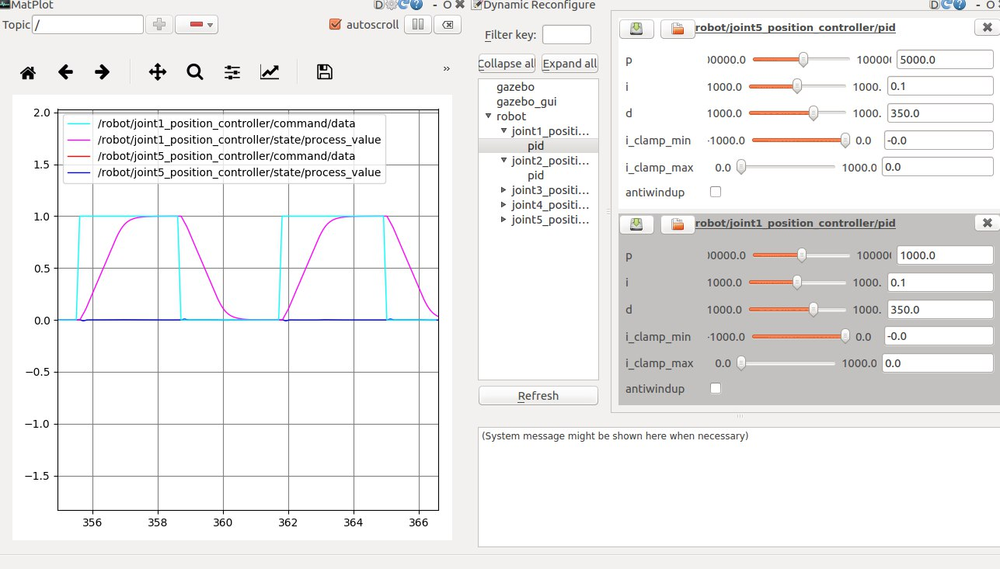
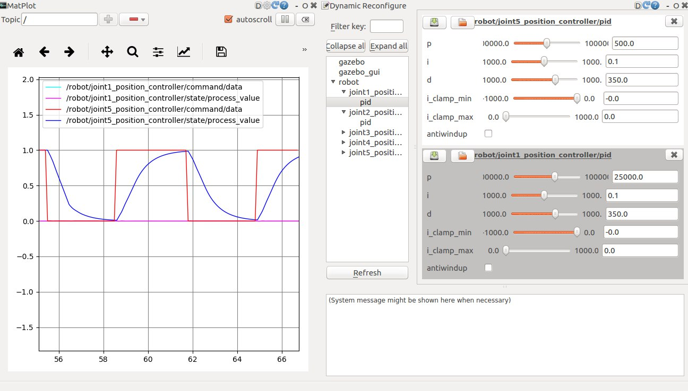
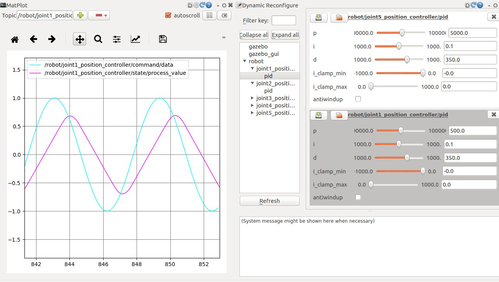
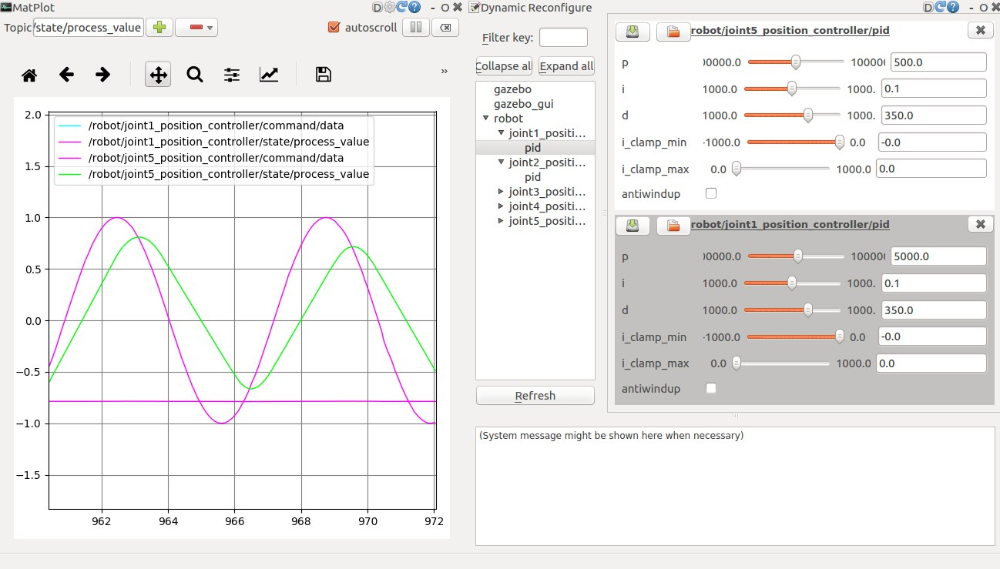
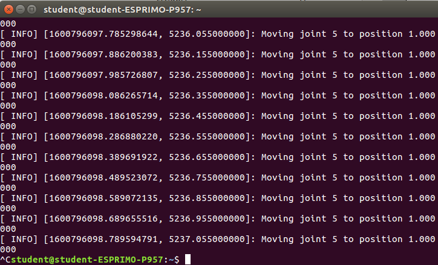
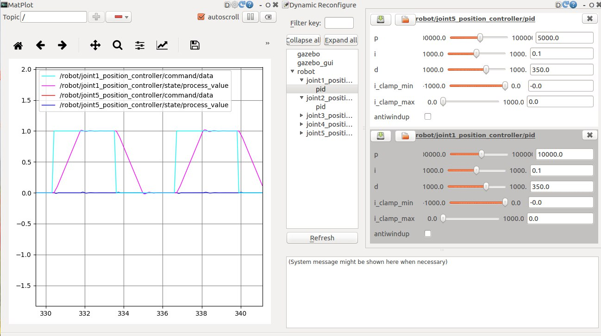
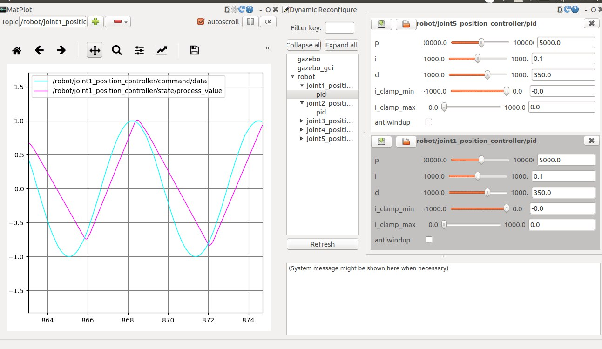
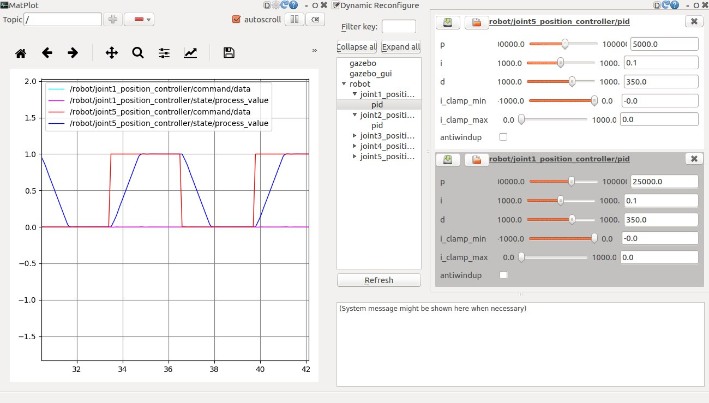
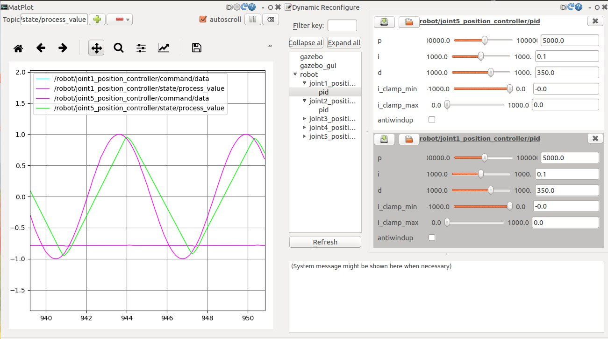

# Laboratory 3: Joint-Control-by-ROS-Gazebo

### Note: This project is about controlling a motor in ROS using Gazebo. In this laboratory the package [test_move](https://github.com/aikesha/Robotics-II-Control-and-Modelling-Laboratory/tree/master/Laboratory-3/test_move) refers to [ros_snake_robot](https://github.com/fenixkz/ros_snake_robot) package and [dynamixel_robot](https://github.com/arebgun/dynamixel_motor) package.

## Requirements
* Ubuntu 16.04
* ROS Kinetic
* Gazebo
## Usage

### Install additional packages that are required for running the planar robot in Gazebo
Install a special control package called ros-control http://wiki.ros.org/ros_control and ros-controllers
http://wiki.ros.org/ros_controllers . These packages were developed by researchers and they published
a research paper [1]:
```command
sudo apt-get install ros-kinetic-ros-control ros-kinetic-ros-controllers
```
### Copy into your CATKIN_WORKSPACE the open source dynamixel packages then compile and do sourcing
```
git clone https://github.com/arebgun/dynamixel_motor
catkin_make
source ~/CATKIN_WORKSPACE/devel/setup.bash
```
### Install the planar robot package
#### Copy to your CATKIN_WORKSPACE folder the planar robot packages developed by Ayan Mazhitov [2] and then compile:
```
git clone https://github.com/fenixkz/ros_snake_robot.git
catkin_make
```
#### Add executable and launch files into your shell (terminal), in other words update your shell by sourcing the setup.bash file in your workspace:
```
source ~/CATKIN_WORKSPACE/devel/setup.bash
```
#### Launch the robot in Gazebo:
```
roslaunch gazebo_robot gazebo.launch
```
#### In new Terminal (or split the Terminator by CTRL+SHIFT+E) see available ROS Topics:
```
rostopic list
```
```bash
Note: dont forget to run your cpp file and rqt to use graph and PID control.
```
### Debugging:
#### If you are using ROS Melodic:
```
sudo apt-get install ros-melodic-gazebo-ros-pkgs ros-melodic-gazebo-ros-control
sudo apt-get --only-upgrade install ros-*
```
#### If you are using ROS Kinetic:
```
sudo apt-get install ros-kinetic-gazebo-ros-pkgs ros-kinetic-gazebo-ros-control
```
## The lab 3 task achievements
### Create a rosnode that will “listen” for std_msgs/Float64 type data and “publish” this data to the joint of the planar robot [1]. The node should send the command to move if the any new incoming value is higher than the previous one.
```cpp
    ros::NodeHandle nh;
    //for second joint Publisher name would be pub2 and for Subscriber sub2
    ros::Publisher pub1 = nh.advertise<std_msgs::Float64>("/robot/joint1_position_controller/command", 100);
    ros::Subscriber sub1 = nh.subscribe("Aigerim_joint1_angle", 1, joint1angleCallback);
```
### Get the step response of (you can create a node that will send a square-wave function):

* the joint at the base of the robot
In my case I made a node that sends a square-wave function as below:
```cpp
float X = 0;

void joint1angleCallback(const std_msgs::Float64 msg)
{
    X = msg.data;
	ROS_INFO("X: %f", X);
}

int main(int argc, char **argv){
    float i = 0.0;
    float k; 
    ros::init(argc, argv, "joint1moving");

    ros::NodeHandle nh;

    ros::Publisher pub1 = nh.advertise<std_msgs::Float64>("/robot/joint1_position_controller/command", 10);
     ros::Subscriber sub1 = nh.subscribe("Aigerim_joint1_angle", 10, joint1angleCallback);
    ros::Rate loop_rate(10);
    ros::Time startTime = ros::Time::now();

    while (ros::ok()) {
                 k = sin(i);
                 if (k > 0) {
	                   k = 1;			
                  } else {
                       k = 0;
                  }
                  std_msgs::Float64 msg_to_send;
                  msg_to_send.data = k;
                  pub1.publish(msg_to_send);
                  ROS_INFO("Moving joint 1 to position %f", msg_to_send.data);
                  i = i + 0.1;
                  ros::spinOnce();
                  loop_rate.sleep();
    }
   return 0;
}
```
The result you can see in the figure below with (Proportional gain of PID = 1000)(for joint 1):


* the joint at the end-effector of the robot
For joint 5 the code is same. The result you can see below in the figure:


### Get the sine-wave response of (you can create a node that will send a sine-wave function):
* the joint at the base of the robot
```cpp
   while (ros::ok()) {
                  t = ros::Time::now().toSec();
                  std_msgs::Float64 msg_to_send;
                  msg_to_send.data = sin(t);
                  pub1.publish(msg_to_send);
                  ROS_INFO("Moving joint 1 to position %f", msg_to_send.data);
                  //i = i + 0.01;
                  ros::spinOnce();
                  loop_rate.sleep();
    }
```
The result you can see below in the figure (with Proportional gain of PID = 500):

* the joint at the end-effector of the robot
For end-effector the code is the same as for base joint 1.
The result you can see below in the figure:

Here you can also see the position from a terminal:


### Decrease the Proportional gain of PID in the joints and repeat II and III. Use rqt (type rqt in terminator, open tab Plugins -> Configuration -> Dynamic Reconfigure). From the available configs find robot->jointNUMBER->PID->P

#### Joint 1:
##### Square wave:

##### Proportional gain of PID = 1000


##### Proportional gain of PID = 10000


##### Sine wave:

##### Proportional gain of PID = 1000


##### Proportional gain of PID = 10000


#### Joint 2:
##### Square wave:

##### Proportional gain of PID = 1000


##### Proportional gain of PID = 10000


##### Sine wave:

##### Proportional gain of PID = 1000


##### Proportional gain of PID = 10000


## Reference
[1] A. Mazhitov, A. Adilkhanov, Y. Massalim, Z. Kappassov and H. A. Varol, "Deformable Object
Recognition Using Proprioceptive and Exteroceptive Tactile Sensing," 2019 IEEE/SICE International
Symposium on System Integration (SII), Paris, France, 2019, pp. 734-739, doi:
10.1109/SII.2019.8700392.

## That's it. Good Luck!
