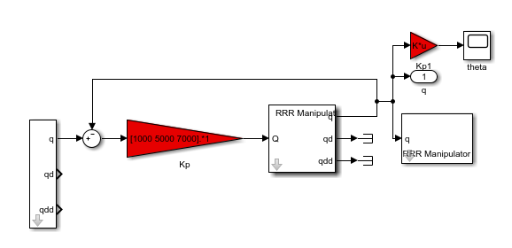
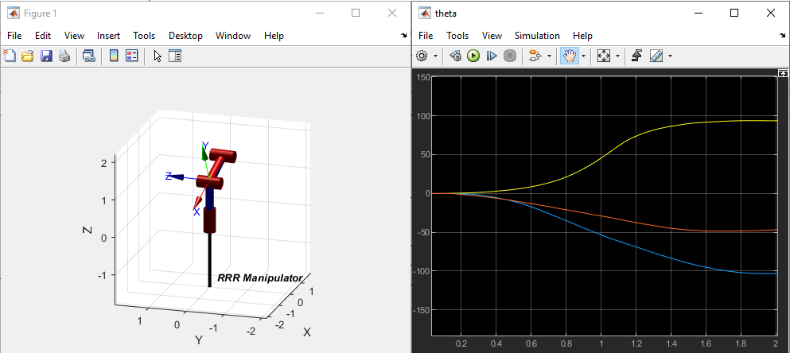
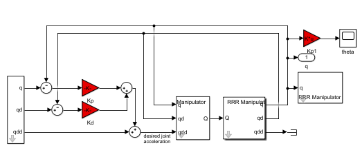
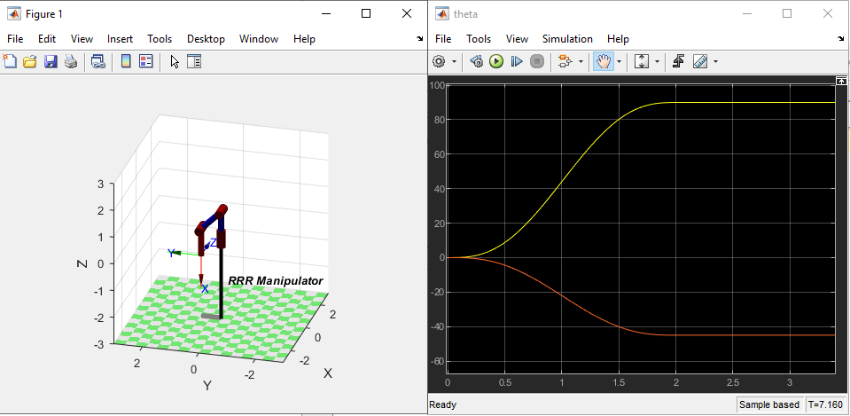
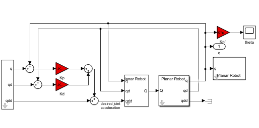
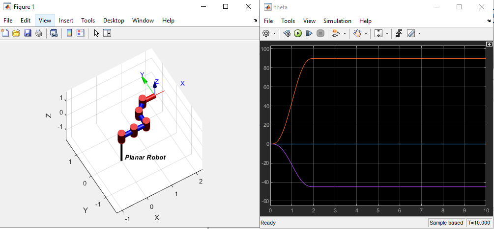

# Laboratory 5 (Part 2): Joint Control of RRR Manipulator by using Peter Corke’s Robotics Toolbox in MatLab

### Note: This laboratory uses Lab 5 materials for PID control in Simulink.

The video [result is on YouTube](https://youtu.be/3WVUHQYB6qY).

## Requirements
* Windows 10
* MatLab R2018b
(It is okay to use other OS or version of MatLab)

## The lab 5 Part 2 task achievements

### Step 1: 

### Step 2-3:

### Extra Task: Planar Robot (steps 1-3 copied).
The steps 1-3 were reused for this task, and 2 more links with some random inertia and mass values. The result can be seen from here:

## That's it. Good Luck!
