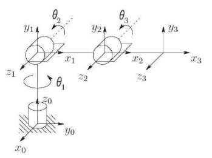
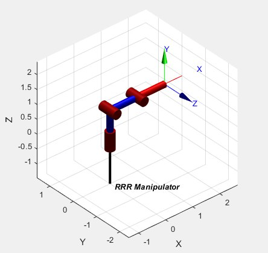
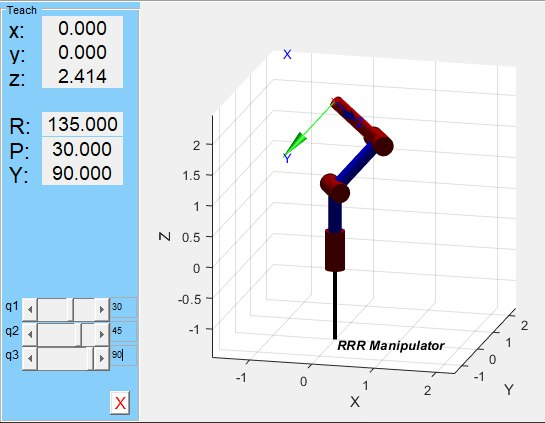
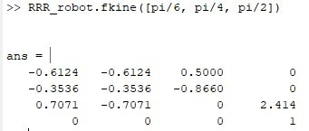
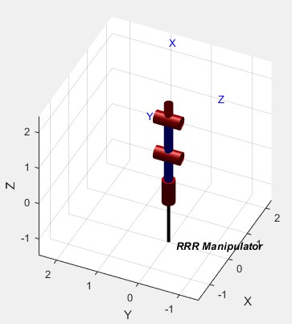
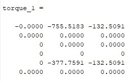
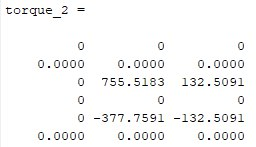

# Laboratory 5: MatLab Control of RRR Manipulator using Peter Corke’s Robotics Toolbox

### Note: This project is about modelling and controlling a 3DOF RRR Manipulator in MatLab in the joint space using different commands and toolbox. In this laboratory the Robotics Toolbox from [Peter Corke's website](https://petercorke.com/) was used. 

The video [result is on YouTube](https://youtu.be/3WVUHQYB6qY).

## Requirements
* Windows 10
* MatLab R2018b
(It is okay to use other OS or version of MatLab)


## The lab 5 task achievements

### Step 1: Affix the frames to each link.
<p align="center"></p>

### Step 2:Find the DH parameters.

| joint i | alpha | a | d | Ө |
| -- | -- | -- | -- | -- |
| 1 | 90 deg | 0 | 1 | Ө1 |
| 2 | 0 deg | 1 | 0 | Ө2 |
| 3 | 0 deg | 1 | 0 | Ө3 |

### Step 3: Consider each of the three links as a cylinder of homogeneous density having radius of the cross section Ri=0.05m and calculate by using the following formula the associate inertia matrix.
      
         [ 0 0 0 ]         [ 0.0125  0       0      ]              [ 0.0125  0       0      ] 
    I1 = [ 0 0 0 ]    I2 = [ 0       0.8396  0      ]         I2 = [ 0       0.8396  0      ]
         [ 0 0 0 ]         [ 0       0       0.8396 ]              [ 0       0       0.8396 ]
     
### Step 4: Model the robot by using the toolbox in Matlab.
```script
L(1) = Revolute('d', 1, 'a', 0, 'alpha', pi/2, ...
    'I', [0, 0, 0], ...
    'r', [0, 0, 0.5], ...
    'm', 0, ...
    'Jm', 1e-4, ...
    'G', 500, ...
    'B', 10e-4, ...
    'Tc', 10e-4, ...
    'qlim', [-180 180]*deg );

L(2) = Revolute('d', 0, 'a', 1, 'alpha', 0, ...
    'I', [0.0125, 0.83958, 0.83958], ...
    'r', [0.5, 0, 0], ...
    'm', 10, ...
    'Jm', 1e-4, ...
    'G', 500, ...
    'B', 10e-4, ...
    'Tc', 10e-4, ...
    'qlim', [-90 90]*deg );

L(3) = Revolute('d', 0, 'a', 1, 'alpha', 0,  ...
    'I', [0.0125, 0.83958, 0.83958], ...
    'r', [1.5, 0, 0], ...
    'm', 10, ...
    'Jm', 1e-4, ...
    'G', 500, ...
    'B', 10e-4, ...
    'Tc', 10e-4, ...
    'qlim', [-90 90]*deg );
```

### Step 5: Plot the robot model and test it by using the virtual teach-pendant.
```script
RRR_robot.plot([0, 0, 0])
```
<p align="center"></p>

```script
RRR_robot.teach()
```
<p align="center"></p>

We can see that the values shown in the above of the control panel are the same as the values appeared in the Control Window:
<p align="center"></p>


### Step 6: Find the static torques required at the joints to keep the manipulator in the home position and hold position.
#### For Home position, we get:
```script
figure(1)
RRR_robot.plot(home_position)
% RRR_robot.teach()
```
<p align="center"></p>

```script
%Home position
j1 = RRR_robot.jacob0(home_position);
grav_1 = RRR_robot.gravload([0, 0, 1]);
torque_1 = j1.*grav_1
```
<p align="center"></p>

#### For Hold position, we get:
```script
figure(2)
RRR_robot.plot(hold_position)
% RRR_robot.teach()
```
<p align="center"></p>

```script
%Hold position
j2 = RRR_robot.jacob0(hold_position);
grav_2 = RRR_robot.gravload([0, 0, 1]);
torque_2 = j2.*grav_2
```
<p align="center"></p>

* According to the results, the torques for HOLD pose are higher than in HOME pose, which means computations in Matlab
are most probably correct.

### Question

- Why the torques are different for different configurations? 
- Because torques were calculated using the formula [torque] = inverse(J)* G which shows that torque depends on Jacobian matrix, which is by the way depends on position of a manipulator.


## That's it. Good Luck!
