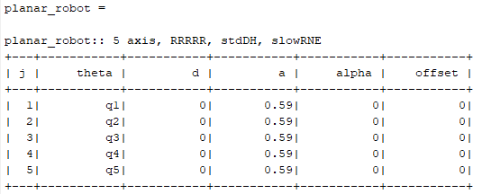
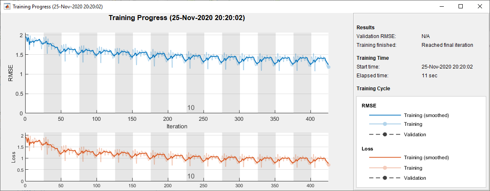
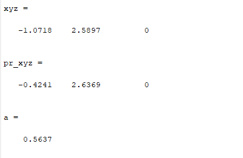
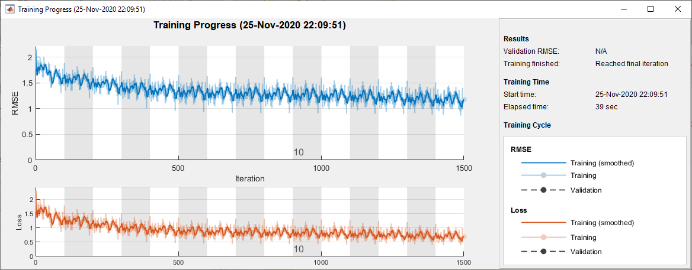
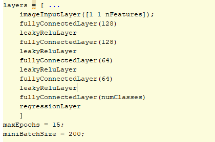
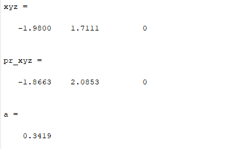

# Laboratory 7 (Part 2):  Obtain Inverse Kinematics without the robot model using Matlab scripts by tuning the Neural Networks

## Requirements
* Windows 10
* MatLab R2018b
(It is okay to use other OS or version of MatLab)

## The lab 7 task achievements

### Parameters of the Planar Robot
<p align="center"></p>

### The first steps of tuning with mean error eqaul to just below 60%.
<p align="center"></p>

<p align="center"></p>

### The best one to tune, and the error is about 30%
<p align="center"></p>

### For this I incresed the number of data to 20000, so that it took around 25 minutes to train the model:
<p align="center"></p>

### And the result is:
<p align="center"></p>
      
### And Scatter3 to show FK resutls:
```script
home = [45 45 0 45 -45]*deg; 
planar_robot.plot(home)
pose_end2 = planar_robot.fkine(home); 
hold on

%real
xyz1 = transl(pose_end2);
scatter3(xyz1(1),xyz1(2),xyz1(3), '*')

% predicted
samplep = ones(1,1,3);
samplep(1,:) = xyz1;
xyz2 = predict(net, samplep);
predicted = [xyz2(1),xyz2(2),xyz2(3), xyz2(4), xyz2(5)]
pose_end2 = planar_robot.fkine(predicted);
xyz3 = transl(pose_end2);
hold on 
scatter3(xyz3(1),xyz3(2),xyz3(3),'filled')
```

## That's it. Good Luck!
