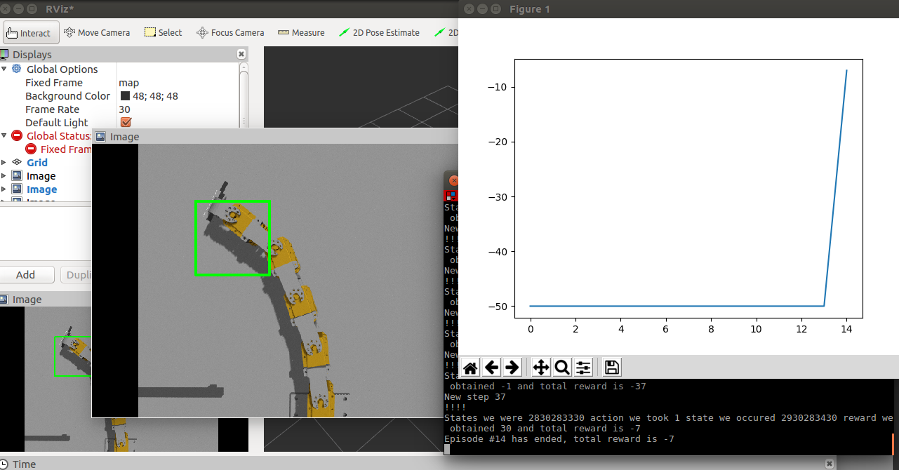
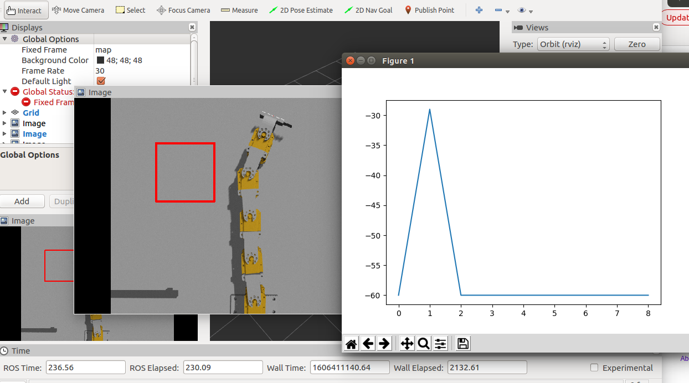
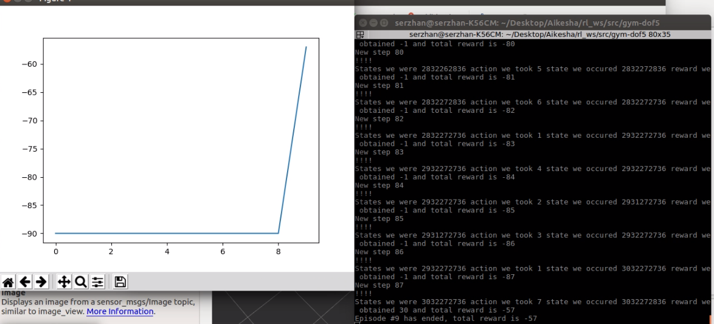

# Laboratory 8: Deep Reinforcement Learning by ROS-Gazebo-RViz* to solve IK problem

### Note: In this project I used the package [rl_ws](https://github.com/fenixkz/rl_ws) package.
### Goal: To locate Planar robot's end-effector to the desired location.

## Requirements
* Ubuntu 16.04
* ROS Kinetic
* Gazebo 7
* RViz*

## Prerequisites:
Gym:
```python
$ pip install gym
```

## The lab 3 task achievements

### Initial state

* reward function:                          no change                  
* qlearn hyper parameters:                  alpha=0.9, gamma=0.1, epsilon=0.1
* number of episodes:                       5000
* step:                                     100
* sample angle:                             no change

### First test for learning

* reward function:                          no change                  
* qlearn hyper parameters:                  alpha=0.9, gamma=0.1, epsilon=0.1
* number of episodes:                       15
* step:                                     50
* sample angle:                             no change

As the result in 15 minutes we could reach the desired location. The [video](https://youtu.be/gKrhiIqM3Pg) is also provided.


### Second test for learning

* reward function:                          no change                  
* qlearn hyper parameters:                  alpha=0.2, gamma=0.8, epsilon=0.8
* number of episodes:                       9
* step:                                     60
* sample angle:                             no change

As the result in about 40 minutes we could reach the desired location. The [video](https://youtu.be/6Cw2Ap2KtXk) is also provided.


### Third test for learning

* reward function:                          no change                  
* qlearn hyper parameters:                  alpha=0.1, gamma=0.7, epsilon=0.9
* number of episodes:                       10
* step:                                     90
* sample angle:                             no change

As the result in about 50 minutes we could reach the desired location. The [video](https://youtu.be/3KHoX-JgL2M) is also provided.


## Conclusion
Unfortunately I couldn't experiment much more with the parameters, as the PC was not good enough. Also, (use_q_table.py)[https://github.com/aikesha/Robotics-II-Control-and-Modelling-Laboratory/blob/master/Laboratory-8/gym-dof5/use_q_table.py] worked uncorrectly by turning to the right side always. Even though there was a little number of tests, I understood that using maximum epsilon and minimum alpha shows better performance.

## That's it. Good Luck!
